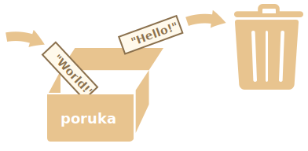

# Promjenljive ili varijable (eng. variables)

Većinu vremena, JavaScript aplikacija mora raditi sa informacijama. Evo dva primjera:
1. Online prodavnica -- informacije mogu uključivati proizvode koji se prodaju i kolica za kupovinu (šta je u njoj).
2. Aplikacija za razgovor -- informacije mogu uključivati korisnike, poruke i još mnogo toga.

Varijable se koriste da se pohrane ove informacije.

## Varijabla

[Varijabla](https://en.wikipedia.org/wiki/Variable_(computer_science)) je "imenovano spremište" (eng. named storage) za podatke. Možemo koristiti varijable da pohranimo poruke, posjetioce, i ostale podatke.

Da napravimo varijablu u JavaScript-u, kortimo `let` ključnu riječ (eng. keyword).

Izjava ispod pravi (u drugim riječima: *proglašava*) varijablu sa imenom "poruka".

```js
let poruka;
```

Sada, možemo staviti podatke u nju putem operatora dodjele `=`:

```js
let poruka;

*!*
<<<<<<< HEAD
poruka = 'Hello'; // store the string
=======
message = 'Hello'; // store the string 'Hello' in the variable named message
>>>>>>> 1edb0a38330b54d2e1916f5193fc043e6fbbea78
*/!*
```

Tekst (eng. string) je sada spašen u memorijsko područje koje se odnosi na varijablu. Možemo ga pristupiti koristeći ime same varijable:

```js run
let poruka;
poruka = 'Hello!';

*!*
alert(poruka); // prikazuje sadržaj varijable
*/!*
```

Da budemo sažeti, možemo kombinirati deklaraciju i dodjelu neke vrijednosti varijabli u jednu liniju:

```js run
let poruka = 'Hello!'; // deklariši varijablu i dodijeli vrijednost

alert(poruka); // Hello!
```

Možemo deklarisati više varijable u jednoj liniji:

```js no-beautify
let korisnik = 'John', godine = 25, poruka = 'Hello';
```

To može izgledati kraće, ali mi to ne preporučujemo. Zarad bolje čitljivosti, molim vas koristite jednu liniju po varijabli.

Multilinijska varijanta je malo duža, ali lakša za pročitati:

```js
let korisnik = 'John';
let godine = 25;
let poruka = 'Hello';
```

<<<<<<< HEAD
Neki ljudi isto deklarišu više varijabli u ovom multilinijskom stilu:
=======
Some people also define multiple variables in this multiline style:

>>>>>>> 1edb0a38330b54d2e1916f5193fc043e6fbbea78
```js no-beautify
let korisnik = 'John',
  godine = 25,
  poruka = 'Hello';
```

...I čak i u ovom "zarez-prvo" stilu:

```js no-beautify
let korisnik = 'John'
  , godine = 25
  , poruka = 'Hello';
```

Tehnički, sve ove varijante rade istu stvar. Tako da je ovo pitanje ličnog ukusa i estetike.

````smart header="`var` umjesto `let`"
U starijim skriptama, možete naći još jednu ključnu riječ: `var` umjesto `let`:

```js
*!*var*/!* poruka = 'Hello';
```

`var` ključna rijec je *skoro* ista kao `let`. Isto deklariše varijablu, ali u malom drugačijem, "stara-škola" (eng. old-school) načinu.

Postoji manjih razlika između `let` i `var`, ali one za nas nisu još bitne. Proučit ćemo ih u detalje u poglavlju <info:var>.
````

## Stvarna životna analogija

Možemo lagano shvatiti koncept "varijable" ako je zamislimo kao "kutiju" za podatke, sa unikatno imenovanim naljepnicama.

Na primjer, varijabla `poruka` može biti zamišljena kao kutija na kojoj piše `"poruka"` koja u sebi ima vrijednost "Hello!".


Možemo postaviti bilo koju vrijednost u kutiju.

<<<<<<< HEAD
Isto tako je možemo promijeniti koliko puta hoćemo:
=======
We can also change it as many times as we want:

>>>>>>> 1edb0a38330b54d2e1916f5193fc043e6fbbea78
```js run
let poruka;

poruka = 'Hello!';

poruka = 'World!'; // vrijednost promijenjena

alert(poruka);
```

Kada je vrijednost promijenjena, stari podaci su izbrisani iz te varijable:



Možemo isto deklarisati (ili proglasiti) dvije varijable i kopirati podatke iz jedne u drugu.

```js run
let hello = 'Hello world!';

let poruka;

*!*
// kopiraj 'Hello world' vrijednost iz hello u poruka
poruka = hello;
*/!*

// sada ove dvije varijable imaju istu vrijednost
alert(hello); // Hello world!
alert(poruka); // Hello world!
```

````warn header="Deklarisanje dva puta će izazvati grešku"
Varijabla se treba samo jednom deklarisati.
 
Ponovna deklaracija iste varijable je greška:

```js run
let poruka = "Ovo";

// ponovljeno 'let' će izazvati grešku
let poruka = "Ono"; // SyntaxError: 'poruka' has already been declared (ova greška će se pojaviti)
```
Tako da varijablu samo jednom trebamo deklarisati, i onda se na nju odnositi bez `let`.
````

```smart header="Funkcionalni jezici"
Interesantno je napomenuti da postoje [funkcionalni](https://en.wikipedia.org/wiki/Functional_programming) programski jezici, kao što je [Scala](http://www.scala-lang.org/) ili [Erlang](http://www.erlang.org/) koji zabranjuju mijenjanje vrijednosti varijable.

U takvim jezicima, kada je vrijednost pohranjena "u kutiju", tu je zauvijek. Ako želimo da pohranimo nešto drugo, jezik nas tjera da napravimo novu kutiju (da deklarišemo novu varijablu). Ne možemo ponovo upotrijebiti staru.

Iako zvuči malo čudno na prvi pogled, ovi jezici su veoma sposobni za ozbiljan razvoj. Još bolje od toga, postoje područja kao što su paralelno računanje gdje ova limitacija doprinosi određene prednosti. Učenje ovakvih jezika (iako ih ne planirate koristiti ubrzo) je preporučeno da proširite um.
```

## Imenovanje varijabli [#variable-naming]

Postoje dvije limitacije kada imenujemo varijable u JavaScript-u:

1. Ime mora sadržiti samo slova, brojeve, ili simbole `$` i `_`.
2. Prvi znak ne smije biti broj.

Primjeri ispravnih imena:

```js
let korisničkoIme;
let test123;
```

Kada ime sadrži više riječi, [camelCase](https://en.wikipedia.org/wiki/CamelCase) se često koristi. To je: riječi idu jedna iza druge, svaka riječ osim prve započinje sa velikim slovom `mojeVeomaDugoIme`.

Šta je interesantno -- znak dolara `'$'` i donja crtica `'_'` mogu se isto koristiti u imenima. To su obični simboli, kao i slova, bez specijalnog značenja.

Ova imena su ispravna:

```js run untrusted
let $ = 1; // deklarišemo varijablu sa imenom "$"
let _ = 2; // a sada varijablu sa imenom "_"

alert($ + _); // 3
```

Primjeri netačnih imena:

```js no-beautify
let 1a; // ne smije započeti sa brojem

let my-name; // crtica nije dozvoljena u imenu
```

<<<<<<< HEAD
```smart header="Velika i mala slova su bitna"
Varijable nazvane `jabuka` i `jabuKA` su dvije različite varijable.
=======
```smart header="Case matters"
Variables named `apple` and `APPLE` are two different variables.
>>>>>>> 1edb0a38330b54d2e1916f5193fc043e6fbbea78
```

````smart header="Ne latinska slova su dozvoljena, ali nije preporučeno"
/ Napomena: Ja prevodim sa engleskog na bosanski jezik, zato koristim č,ć,š,đ,ž u varijablama, ali preporučeno je koristiti normalna engleska slova. Od sada će varijable i cijeli kod biti na engleskom jeziku, ne brinite, i dalje ću prevesti tekst zadataka, ali će kod u istim biti na engleski. - prevodioc @aiyodev /

Moguće je koristiti bilo koji jezik, uključujući ćirilična slova i čak hieroglife, kao ovdje:

```js
let имя = '...';
let 我 = '...';
```

Tehnički, ovdje nema greške. Ovakva imena su dozvoljena, ali postoji internacionalna konvencija da se koristi engleski jezik prilikom imenovanja. Iako pišemo malu skriptu, može imati dug život ispred sebe. Ljudi iz ostalih zemalja će možda nekada trebati da pročitaju.
````

````warn header="Rezervisana imena"
Postoji [lista rezervisanih riječi](https://developer.mozilla.org/en-US/docs/Web/JavaScript/Reference/Lexical_grammar#Keywords), koje se ne mogu koristiti kao imena varijabli zato što se koriste od samog jezika.

Na primjer: `let`, `class`, `return`, i `function` su rezervisani.

Kod ispod će izbaciti sintaksnu grešku:

```js run no-beautify
let let = 5; // ne možemo nazvati varijablu "let", greska!
let return = 5; // ispod je ne možemo nazvati "return", greska!
```
````

````warn header="Dodjela vrijednosti bez `use strict`"

Obično, trebamo definisati varijablu prije nego što je možemo koristiti. Ali u starim vremenima, tehnički je bilo moguće da se napravi varijabla sa dodjelom bez korištenja `let`. Ovo i dalje radi ako ne koristimo `use strict` u našim skriptama kako bismo održali kompatibilnost sa starim skriptama.

```js run no-strict
// napomena: nema "use strict" u ovom primjeru

num = 5; // varijabla "num" (eng. number - broj) je kreirana ako nije postojala već

alert(num); // 5
```

Ovo je loša praksa i može izazvati grešku u strogom načinu rada:

```js
"use strict";

*!*
num = 5; // greška: num nije definisan
*/!*
```
````

## Konstante

Da deklarišemo konstantnu (nepromjenljivu) varijablu, koristimo `const` umjesto `let`:

```js
const myBirthday = '18.04.1982'; //
```

Varijable deklarisane sa `const` se zovu "konstante" (eng. constants). Ne mogu im se mijenjati vrijednosti. Pokušaj da to uradimo izavat će grešku:

```js run
const myBirthday = '18.04.1982';

myBirthday = '01.01.2001'; // greška, ne može se promijeniti vrijednost konstante!
```

Kada je programer siguran da se varijabla nikada neće promijeniti, onda je mogu deklarisati putem `const` da garantuju i da jasno komuniciraju tu činjenicu svima.

<<<<<<< HEAD

### Konstante napisane velikim slovima
=======
### Uppercase constants
>>>>>>> 1edb0a38330b54d2e1916f5193fc043e6fbbea78

Postoji široko rasprostranjena praksa da se konstante koriste kao nadimak za vrijednosti koje su poznate prije izvršavanja i koje je teško zapamtiti.

Takve konstante nazivamo koristeći velika slova i donje crtice.

Na primjer, hajmo napraviti konstante za boje u "web" (heksadecimalnom) formatu:

```js run
const COLOR_RED = "#F00";
const COLOR_GREEN = "#0F0";
const COLOR_BLUE = "#00F";
const COLOR_ORANGE = "#FF7F00";

// ...kada želimo odabrati boju
let color = COLOR_ORANGE;
alert(color); // #FF7F00
```

Prednosti:

- `COLOR_ORANGE` je mnogo lakše za zapamtiti nego `"#FF7F00"`.
- Mnogo je teže napisati `"#FF7F00"` bez greške od `COLOR_ORANGE`.
- Kada čitamo kod, `COLOR_ORANGE` je mnogo značajnije od `#FF7F00`.

Kada trebamo koristiti velika slova za konstante a kada ćemo ih nazvati normalno? Hajmo učiniti to malo jasnije.

"Konstantna" varijabla znači da se njena vrijednost nikada ne mijenja. Ali postoje konstante koje su poznate prije izvršavanja (kao heksadecimalna vrijednost za crvenu boju) i postoje konstante koje su *izračunate* tokom izvršavanja, ali se opet ne mijenjaju nakon početne dodjele.

<<<<<<< HEAD
Na primjer:
=======
For instance:

>>>>>>> 1edb0a38330b54d2e1916f5193fc043e6fbbea78
```js
const pageLoadTime = /* vrijeme potrebno da se stranica učita */;
```

Vrijednost `pageLoadTime` nije poznata prije učitavanja stranice, tako da je ovako nazvana. Ali i dalje je konstanta jer ne mijenja vrijednost poslije inicijalne dodjele.

<<<<<<< HEAD
U drugim riječima, konstante napisane velikim slovima se samo koriste kao nadimci za "tvrdo-kodirane" vrijednosti.
=======
In other words, capital-named constants are only used as aliases for "hard-coded" values.
>>>>>>> 1edb0a38330b54d2e1916f5193fc043e6fbbea78

## Imenujte varijable ispravno

Pričajući o varijablama, ima još jedna ekstremno bitna stvar.

Ime varijable mora imati jasno, očigledno značenje, koje opisuje podatke koje u sebe pohranjuje.

Imenovanje varijabli je jedna od najvažnijih i najkompleksnijih vještina u programiranju. Brz pogled na nečija imena varijabli može otkriti da li je taj kod pisan od strane početnika ili iskusnog programera.

U pravom projektu, većina vremena je potrošena na modificiranje i proširivanje već postojeće baze koda a ne pisanja nečega totalno odvojenog od početka. Kada se vratimo na kod nakon nekog vremena, puno je lakše naći informacije koje su dobro imenovane. Ili, u drugim riječima, kada varijable imaju jasna imena.

Molimo vas, provedite vremena razmišljajući o dobrom imenu za varijablu prije nego što je deklarišete. Radeći to, isplatit će vam se kasnije.

Neka dobra pravila za pratiti su:

- Koristite imena koja ljudi mogu pročitati kao što su `userName` ili `shoppingCart`.
- Nemojte koristiti skraćenice ili kratka imena kao `a`, `b` ili `c`, osim ako znate sto posto šta radite.
- Nek vam imena budu maksimalno detaljna, ali i sažeta. Primjeri loših imena su `data` i `value`. Takva imena ne govore ništa. Okej ih je samo koristiti u kontekstu kada je izuzetno očigledno na šta se varijabla odnosi.
- Prihvatite uslove unutar vašeg tima. Ako je posjetilac stranice "user" onda trebamo nazvati srodne varijable `currentUser` ili `newUser` umjesto `currentVisitor` ili `newManInTown`.

Zvuči jednostavno? Itekako jeste, ali kreiranje deskriptivnih i sažetih imena za varijable u praksi nije. Probaj sam.

```smart header="Ponovo upotrebi ili napravi?"
I zadnja napomena. Postoje lijeni programeri koji, umjesto da deklarišu novu varijablu, skloni su tome da ponovo upotrebe već postojeće.

Kao rezultat, njihove varijable su kao kutije u koje ljudi bacaju različite stvari bez mijenjanja naljepnice. Šta je sada u kutiji? Ko zna? Moramo doći bliže i provjeriti.

Takvi programeri na početku uštede malo na vremenu ali izgube deset puta više na ispravljanju grešaka (eng. debugging).

Dodatna varijabla je dobra, a ne zla.

Moderni JavaScript minifieri i pretraživači optimiziraju kod dovoljno dobro, tako da neće izazvati probleme u performansama. Korištenje različitih varijabli za različite vrijednosti čak može pomoći motoru da optimizira vaš kod.
```

## Sažetak

Možemo deklarisati varijable da pohranjuju podatke koristeći `var`, `let`, ili `const` ključne riječi.

- `let` -- je moderna deklaracija varijable.
- `var` -- je stara deklaracija varijable. Obično je uopšte ne koristimo, ali ćemo spomenuti male razlike između `let` i var u poglavlju <info:var>, za svaki slučaj.
- `const` -- je kao `let`, ali se vrijednost varijable ne može mijenjati.

Varijable trebaju biti imenovane na način koji nam omogućava da lagano shvatimo sta je unutar njih.
